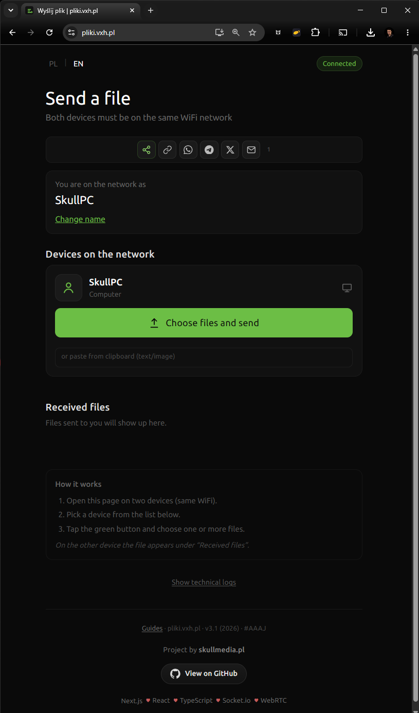
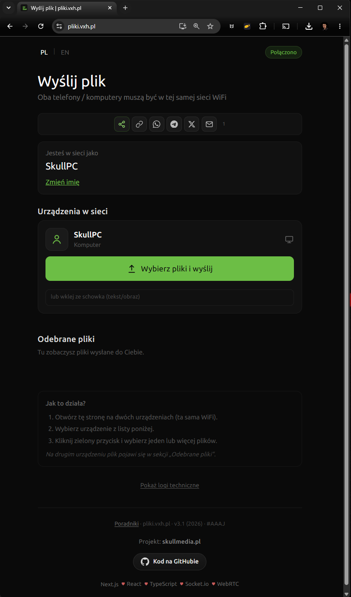
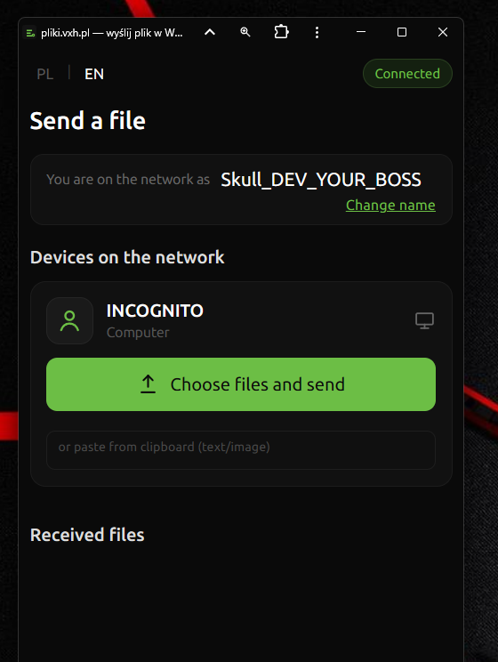
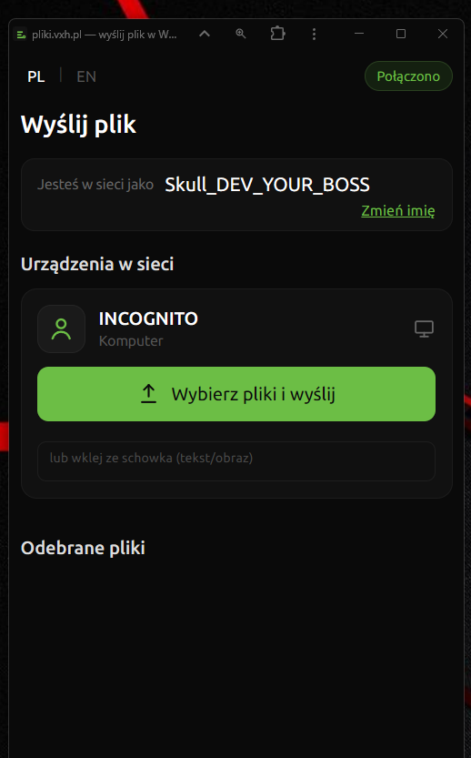

# pliki.vxh.pl

**Send files on the same WiFi — no cloud, no account.**

[English](#english) · [Polski](#polski)

---

<a id="english"></a>

## English

**pliki.vxh.pl** is a lightweight web app for sending files between phones, tablets, and computers on the same local network. Data travels **directly between devices** over **WebRTC**. The server only handles **Socket.io** signaling — files never pass through the backend.

**Live:** [https://pliki.vxh.pl](https://pliki.vxh.pl)

**Dev server (preview):** [https://pliki-vxh-pl-developer.vpsskull.vxh.pl](https://pliki-vxh-pl-developer.vpsskull.vxh.pl) — branch `dev`, for testing only; use production for everyday file sharing.

### Web app





### Features

**P2P transfer on LAN**  
Open the site on two devices on the same WiFi, pick a receiver, and send one or many files in a row.

**Paste & quick send**  
Paste text or an image from the clipboard into the inline field under each device — no extra dialogs.

**Text notes**  
Send short messages as `.txt` files with a readable preview (Markdown & HTML rendering, copy to clipboard).

**Received files**  
Thumbnails for images, video, and text. Preview with Video.js for video. Download single files, whole bundles, or a **ZIP** of a batch.

**No login, no cloud**  
No account. No third-party file storage.

**PWA**  
Install to your home screen for a focused, app-like UI (recommended on iPhone via Safari).





**Share the app**  
Quick share via WhatsApp, Telegram, X, email, or copy link.

### Public pages: guides & reviews (not a second app)

The **file-sending UI lives only at `/`** (root). Everything else is **static marketing/help** so people can find the project on Google and understand it before opening the app — not extra products, not login walls, not cloud storage.

| Path | Purpose |
|------|---------|
| [`/pl`](https://pliki.vxh.pl/pl), [`/en`](https://pliki.vxh.pl/en) | **Guides hub** — topics (WiFi transfer, iPhone, PWA, bundles, drag & drop, …) with search, categories, and sort. Helps SEO and answers common questions without bloating the main UI. |
| `/pl/{slug}`, `/en/{slug}` | **Individual guide articles** — same content idea, one topic per URL for search engines and shared links. |
| [`/reviews`](https://pliki.vxh.pl/reviews), [`/en/reviews`](https://pliki.vxh.pl/en/reviews) | **Reviews** — mix of real checked feedback and extra copy written for SEO/social proof. If you’re reading this on GitHub: don’t take it personally. |

Why keep them in the repo?

- **Discovery** — queries like “send file over WiFi without app” should land on helpful pages, not a blank landing.
- **Trust** — short guides and reviews explain *what* the tool does before someone tries it on two devices.
- **Maintenance** — copy lives in `lib/seo/`; no impact on WebRTC, Socket.io, or transfer logic.

If you open a PR: please don’t delete these routes thinking they’re cruft — they’re intentional. Improvements to copy and accessibility are welcome.

### How it works

1. Open [pliki.vxh.pl](https://pliki.vxh.pl) on two devices on the **same WiFi**.
2. Devices on the network appear under **Devices on the network**.
3. Tap the green button to pick files, or paste text/image into the field below.
4. On the other device, files show up under **Received files**.

### Local development

Requirements: **Node.js 22+**, **pnpm 10+**

```bash
pnpm install
pnpm dev
```

App URL: `http://localhost:3000`

Production build locally:

```bash
pnpm build
pnpm start
```

### Production (CapRover)

1. Create an app in CapRover.
2. Enable **WebSocket Support** in HTTP Settings.
3. Deploy this repo (`Dockerfile` + `captain-definition`).
4. Container port: **80**.

Copy `.env.example` → `.env` for local dev (`.env` is gitignored).

| Variable | Default | Description |
|----------|---------|-------------|
| `PORT` | `80` (Docker) / `3000` (dev) | Listen port |
| `HOSTNAME` | `0.0.0.0` | Bind address |
| `NEXT_PUBLIC_SITE_URL` | `https://pliki.vxh.pl` | Canonical URL |
| `NEXT_PUBLIC_DEV_BANNER` | off | Set to `1` on the dev CapRover app to show the top warning bar |
| `NEXT_PUBLIC_OFFICIAL_SITE_URL` | `https://pliki.vxh.pl` | Link target in the dev banner |

**Dev CapRover app** (`pliki-vxh-pl-developer.vpsskull.vxh.pl`): deploy branch `dev`, set `NEXT_PUBLIC_DEV_BANNER=1`.

### Stack

| Layer | Tech |
|-------|------|
| Frontend | Next.js 15, React 19 |
| File transfer | WebRTC DataChannels |
| Signaling | Socket.io (`server.js`) |
| Video preview | Video.js |
| Deploy | Docker, CapRover |

### Project layout

```
app/              Next.js routes (`/` app, `/pl` `/en` guides, `/reviews`, …)
components/       UI (+ `components/seo/` for static pages)
lib/              WebRTC, PWA, notes, bundles, `lib/seo/` (guides, sitemap, reviews copy)
server.js         Next.js + Socket.io + API
server/           Service worker helpers
docs/assets/      README screenshots (WEB*.png, PWA*.png)
styles/           CSS
```

### Known limitations

On **iPhone / mobile**, receiving very large files may hit browser memory limits. Prefer Safari, install as PWA, and receive huge videos on a desktop when possible.

### Security

Files go device-to-device on the LAN. The server does not store transferred content. Signaling groups peers by public IP (same network).

### License

[MIT](LICENSE) · © 2026 [skullmedia.pl](https://skullmedia.pl)

---

<a id="polski"></a>

## Polski

**Szybkie wysyłanie plików w tej samej sieci WiFi — bez chmury, bez konta.**

**pliki.vxh.pl** to lekka aplikacja webowa do transferu plików między telefonem, tabletem i komputerem w sieci lokalnej. Pliki lecą **bezpośrednio między urządzeniami** przez **WebRTC**. Serwer obsługuje tylko sygnalizację **Socket.io** — pliki **nie przechodzą** przez backend.

**Strona:** [https://pliki.vxh.pl](https://pliki.vxh.pl)

**Serwer dev (podgląd):** [https://pliki-vxh-pl-developer.vpsskull.vxh.pl](https://pliki-vxh-pl-developer.vpsskull.vxh.pl) — branch `dev`, tylko do testów; do codziennego użytku wybierz produkcję.

### Aplikacja web


### Funkcje

**Transfer P2P w LAN**  
Wejdź na stronę na dwóch urządzeniach w tej samej WiFi, wybierz odbiorcę i wyślij jeden lub wiele plików.

**Wklejka i szybkie wysyłanie**  
Pole pod urządzeniem: wklej tekst lub obraz ze schowka — bez dodatkowych okien.

**Notatki tekstowe**  
Krótkie wiadomości jako `.txt` z podglądem (Markdown i HTML), kopiowaniem treści do schowka.

**Odebrane pliki**  
Miniaturki obrazów, wideo i tekstu. Podgląd wideo przez Video.js. Pobieranie pojedynczo, całej paczki albo **ZIP** z wielu plików.

**Bez logowania i chmury**  
Bez konta i zewnętrznego storage.

**PWA**  
Dodaj do ekranu początkowego — uproszczony interfejs jak aplikacja (na iPhone: Safari → Udostępnij → Dodaj do ekranu początkowego).


**Udostępnianie**  
WhatsApp, Telegram, X, e-mail, kopiuj link.

### Strony publiczne: poradniki i opinie (to nie druga aplikacja)

**Wysyłanie plików jest tylko pod `/`** (strona główna). Reszta to **statyczne poradniki / marketing**, żeby projekt dało się znaleźć w Google i zrozumieć przed uruchomieniem — bez drugiego produktu, bez logowania, bez chmury na pliki.

| Ścieżka | Po co jest |
|---------|------------|
| [`/pl`](https://pliki.vxh.pl/pl), [`/en`](https://pliki.vxh.pl/en) | **Hub poradników** — tematy (WiFi, iPhone, PWA, paczki, drag and drop, …), wyszukiwarka, kategorie, sortowanie. SEO + odpowiedzi na FAQ bez zaśmiecania głównego UI. |
| `/pl/{slug}`, `/en/{slug}` | **Artykuły** — jeden temat = jeden URL pod wyszukiwarki i linki zewnętrzne. |
| [`/reviews`](https://pliki.vxh.pl/reviews), [`/en/reviews`](https://pliki.vxh.pl/en/reviews) | **Opinie** — sprawdzone recenzje użytkowników plus treści pod SEO. Czytając na GitHubie: nie bierzcie tego do siebie. |

Dlaczego to jest w repozytorium?

- **Widoczność** — ktoś szuka „wyślij plik wifi bez aplikacji” powinien trafić na sensowną stronę, nie pusty landing.
- **Zaufanie** — krótki poradnik i opinie tłumaczą, *co* robi narzędzie, zanim ktoś odpali je na dwóch urządzeniach.
- **Kod** — treści w `lib/seo/`; **nie** mieszają się z WebRTC, Socket.io ani logiką transferu.

PR-y mile widziane, ale prosimy **nie usuwać** tych tras „bo wyglądają na zbędne” — są celowe. Chętnie przyjmujemy poprawki tekstów i dostępności.

### Jak to działa

1. Otwórz [pliki.vxh.pl](https://pliki.vxh.pl) na dwóch urządzeniach w **tej samej WiFi**.
2. Urządzenia pojawią się w **Urządzenia w sieci**.
3. Zielony przycisk → wybór plików, albo wklejka w polu poniżej.
4. Na drugim urządzeniu pliki trafiają do **Odebrane pliki**.

### Uruchomienie lokalne

Wymagania: **Node.js 22+**, **pnpm 10+**

```bash
pnpm install
pnpm dev
```

Adres: `http://localhost:3000`

Tryb produkcyjny lokalnie:

```bash
pnpm build
pnpm start
```

### Produkcja (CapRover)

1. Utwórz aplikację w CapRover.
2. Włącz **WebSocket Support** w HTTP Settings.
3. Wdróż repozytorium (`Dockerfile`, `captain-definition`).
4. Port kontenera: **80**.

Lokalnie: `.env.example` → `.env` (`.env` jest w gitignore).

| Zmienna | Domyślnie | Opis |
|---------|-----------|------|
| `PORT` | `80` / `3000` | Port |
| `HOSTNAME` | `0.0.0.0` | Bind |
| `NEXT_PUBLIC_SITE_URL` | `https://pliki.vxh.pl` | URL kanoniczny |
| `NEXT_PUBLIC_DEV_BANNER` | wył. | `1` na appce dev w CapRover — pasek ostrzegawczy u góry |
| `NEXT_PUBLIC_OFFICIAL_SITE_URL` | `https://pliki.vxh.pl` | Link do produkcji w pasku dev |

**Appka dev w CapRover** (`pliki-vxh-pl-developer.vpsskull.vxh.pl`): branch `dev`, env `NEXT_PUBLIC_DEV_BANNER=1`.

### Stack

| Warstwa | Technologia |
|---------|-------------|
| Frontend | Next.js 15, React 19 |
| Transfer | WebRTC DataChannels |
| Sygnalizacja | Socket.io (`server.js`) |
| Wideo | Video.js |
| Deploy | Docker, CapRover |

### Struktura

```
app/              Trasy Next.js (`/` aplikacja, `/pl` `/en` poradniki, `/reviews`, …)
components/       UI (+ `components/seo/` strony statyczne)
lib/              WebRTC, PWA, notatki, paczki, `lib/seo/` (poradniki, sitemap, opinie)
server.js         Next.js + Socket.io
server/           Licznik, service worker
docs/assets/      Zrzuty do README (WEB*.png, PWA*.png)
styles/           CSS
```

### Znane ograniczenia

Na **iPhone / telefonie** bardzo duże pliki przy odbiorze mogą przekroczyć limity pamięci przeglądarki. Safari + PWA pomaga; duże wideo lepiej odbierać na komputerze.

### Bezpieczeństwo

Pliki tylko między urządzeniami w LAN. Serwer nie przechowuje przesyłanych plików. Sygnalizacja grupuje peerów po publicznym IP (ta sama sieć).

### Licencja

[MIT](LICENSE) · © 2026 [skullmedia.pl](https://skullmedia.pl)
