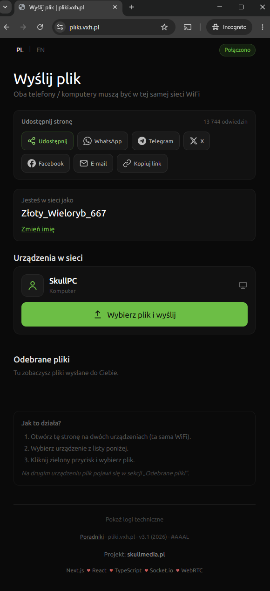

# pliki.vxh.pl

[Polski](#polski) · [English](#english)

---

<a id="polski"></a>

## Polski

**Szybkie wysyłanie plików w tej samej sieci WiFi. Bez chmury, bez konta.**

Aplikacja webowa do transferu plików między telefonem, tabletem i komputerem w sieci lokalnej. Połączenie odbywa się bezpośrednio między urządzeniami przez **WebRTC**. Serwer obsługuje wyłącznie sygnalizację **Socket.io**. Pliki nie przechodzą przez backend.

**Strona:** [https://pliki.vxh.pl](https://pliki.vxh.pl)



### Funkcje

**Transfer P2P w LAN**  
Otwórz stronę na dwóch urządzeniach w tej samej WiFi, wybierz odbiorcę z listy i wyślij plik.

**Bez logowania i bez chmury**  
Nie trzeba zakładać konta ani przesyłać plików przez zewnętrzny serwer plików.

**Odbiór w przeglądarce**  
Odebrane pliki pojawiają się na liście z podglądem zdjęć i wideo, opcją zapisu i podglądu.

**PWA**  
Można dodać stronę do ekranu początkowego na telefonie (Safari → Udostępnij → Dodaj do ekranu początkowego).

**Poradniki SEO**  
Statyczne artykuły po polsku i angielsku pod `/pl` i `/en`.

**Udostępnianie strony**  
Przyciski do WhatsApp, Telegram, X, e-mail i kopiowania linku.

### Jak to działa

1. Wejdź na [pliki.vxh.pl](https://pliki.vxh.pl) na dwóch urządzeniach podłączonych do tej samej sieci.
2. Urządzenia widoczne w tej samej sieci pojawią się na liście „Urządzenia w sieci”.
3. Kliknij zielony przycisk, wybierz plik i wyślij.
4. Na drugim urządzeniu plik trafi do sekcji „Odebrane pliki”.

### Uruchomienie lokalne

Wymagania: **Node.js 22+**, **pnpm 10+**

```bash
pnpm install
pnpm dev
```

Aplikacja startuje pod adresem `http://localhost:3000`.

Tryb produkcyjny lokalnie:

```bash
pnpm build
pnpm start
```

### Produkcja (CapRover)

1. Utwórz aplikację w CapRover.
2. Włącz **WebSocket Support** w HTTP Settings.
3. Wdróż repozytorium. Używany jest `Dockerfile` i `captain-definition`.
4. Port kontenera: **80**.

Lokalnie: skopiuj `.env.example` → `.env` (w repozytorium jest też gotowy `.env` u Ciebie na dysku — git go ignoruje).

Opcjonalne zmienne środowiskowe:

| Zmienna | Domyślnie | Opis |
|---------|-----------|------|
| `PORT` | `80` (Docker) / `3000` (dev) | Port nasłuchu |
| `HOSTNAME` | `0.0.0.0` | Adres bind |
| `NEXT_PUBLIC_SITE_URL` | `https://pliki.vxh.pl` | URL kanoniczny (sitemap, meta) |
| `VISIT_DATA_DIR` | `data/` (dev) / `/app/data` (Docker) | Katalog z `visits.json` |

### Licznik odwiedzin — persistence (CapRover)

Licznik zapisuje się w pliku `visits.json`. **Bez wolumenu każdy redeploy = nowy kontener = licznik od zera.**

1. Przy tworzeniu aplikacji w CapRover włącz **Has Persistent Data** (jeśli app już istnieje bez tego — utwórz nową appkę z tą opcją i przenieś domenę, albo zostaw i zaakceptuj reset przy pierwszym ustawieniu wolumenu).
2. **App Configs** → **Persistent Directories** → dodaj:
   - **Path in App:** `/app/data`
   - **Label:** np. `pliki-visits` (dowolna nazwa)
3. **Save & Update**, potem deploy z GitHub.
4. W logach kontenera po starcie powinno być: `[visits] storage: /app/data/visits.json (loaded count: …)`.

Lokalnie plik trafia do `data/visits.json` w katalogu projektu (gitignore).

### Architektura

| Warstwa | Technologia |
|---------|-------------|
| Frontend | Next.js 15, React 19 |
| Transfer plików | WebRTC DataChannels |
| Sygnalizacja | Socket.io (wbudowany w `server.js`) |
| Grupowanie peerów | Po publicznym IP (użytkownicy z tej samej sieci) |
| SEO | Statyczne strony PL/EN, sitemap, robots |
| Deploy | Docker, CapRover |

### Struktura projektu

```
app/              Trasy Next.js (aplikacja + poradniki SEO)
components/       UI aplikacji i komponenty SEO
lib/              Nicknames, device detection, SEO, share URLs
server.js         Custom server: Next.js + Socket.io + API
server/           Licznik odwiedzin (cache + debounced zapis)
styles/           Style CSS
shared/           Współdzielony kod Node (nicknames)
docs/assets/      Zrzuty ekranu do dokumentacji
```

### Znane problemy

**iPhone / telefon: duże pliki przy odbiorze**  
Na iOS i na wielu telefonach odbiór dużych plików może spowodować **odświeżenie strony** lub przerwanie transferu. Przyczyną są limity pamięci przeglądarki i ograniczenia OPFS na mobile.

Co pomaga:
- odbiór dużych plików na **komputerze** lub tablecie, gdy to możliwe
- na iPhone używaj **Safari** (nie Chrome)
- dodaj stronę do ekranu początkowego (PWA) dla stabilniejszego działania
- na razie unikaj bardzo dużych plików wideo na telefonie jako odbiorcy

### Bezpieczeństwo

Pliki są przesyłane bezpośrednio między urządzeniami w sieci lokalnej. Serwer nie przechowuje przesyłanych plików. Sygnalizacja WebRTC wymaga, aby urządzenia były w tej samej sieci (ten sam publiczny IP).

### Licencja

Projekt na licencji [MIT](LICENSE).

Copyright © 2026 [skullmedia.pl](https://skullmedia.pl)

---

<a id="english"></a>

## English

**Send files on the same WiFi network. No cloud, no account.**

A web app for transferring files between phones, tablets, and computers on your local network. Data goes **device to device** via **WebRTC**. The server only handles **Socket.io** signaling. Files never pass through the backend.

**Live app:** [https://pliki.vxh.pl](https://pliki.vxh.pl)


### Features

**P2P transfer on LAN**  
Open the site on two devices on the same WiFi, pick a receiver from the list, and send a file.

**No login, no cloud**  
No account required. Files are not uploaded to a third party storage service.

**Receive in the browser**  
Incoming files appear in a list with image and video thumbnails, save, and preview options.

**PWA**  
Add the site to your home screen on mobile (Safari → Share → Add to Home Screen).

**SEO guides**  
Static articles in Polish and English at `/pl` and `/en`.

**Share the app**  
Buttons for WhatsApp, Telegram, X, email, and copy link.

### How it works

1. Open [pliki.vxh.pl](https://pliki.vxh.pl) on two devices on the same network.
2. Devices on the same network show up under “Devices on the network”.
3. Tap the green button, choose a file, and send.
4. On the other device the file appears under “Received files”.

### Local development

Requirements: **Node.js 22+**, **pnpm 10+**

```bash
pnpm install
pnpm dev
```

The app runs at `http://localhost:3000`.

Local production mode:

```bash
pnpm build
pnpm start
```

### Production (CapRover)

1. Create an app in CapRover.
2. Enable **WebSocket Support** in HTTP Settings.
3. Deploy this repository. Uses `Dockerfile` and `captain-definition`.
4. Container port: **80**.

Locally: copy `.env.example` to `.env` (your `.env` stays on disk only; git ignores it).

Optional environment variables:

| Variable | Default | Description |
|----------|---------|-------------|
| `PORT` | `80` (Docker) / `3000` (dev) | Listen port |
| `HOSTNAME` | `0.0.0.0` | Bind address |
| `NEXT_PUBLIC_SITE_URL` | `https://pliki.vxh.pl` | Canonical URL (sitemap, meta) |
| `VISIT_DATA_DIR` | `data/` (dev) / `/app/data` (Docker) | Directory for `visits.json` |

### Visit counter — persistence (CapRover)

The counter is stored in `visits.json`. **Without a volume, each redeploy starts a new container and resets the count.**

1. Enable **Has Persistent Data** when creating the app in CapRover.
2. **App Configs** → **Persistent Directories**:
   - **Path in App:** `/app/data`
   - **Label:** e.g. `pliki-visits`
3. **Save & Update**, then deploy.
4. Container logs should show: `[visits] storage: /app/data/visits.json (loaded count: …)`.

Locally the file is `data/visits.json` (gitignored).

### Architecture

| Layer | Technology |
|-------|------------|
| Frontend | Next.js 15, React 19 |
| File transfer | WebRTC DataChannels |
| Signaling | Socket.io (built into `server.js`) |
| Peer grouping | By public IP (same network users) |
| SEO | Static PL/EN pages, sitemap, robots |
| Deploy | Docker, CapRover |

### Project structure

```
app/              Next.js routes (app + SEO guides)
components/       App UI and SEO components
lib/              Nicknames, device detection, SEO, share URLs
server.js         Custom server: Next.js + Socket.io + API
server/           Visit counter (cache + debounced disk write)
styles/           CSS styles
shared/           Shared Node code (nicknames)
docs/assets/      Documentation screenshots
```

### Known issues

**iPhone / phone: large file receive**  
On iOS and many phones, receiving **large files** may **reload the page** or interrupt the transfer. Browser memory limits and OPFS constraints on mobile are the main cause.

What helps:
- receive large files on a **computer** or tablet when possible
- on iPhone use **Safari** (not Chrome)
- add the site to your home screen (PWA) for more stable behavior
- avoid very large video files on a phone as the receiver for now

### Security

Files are sent directly between devices on the local network. The server does not store transferred files. WebRTC signaling requires devices to share the same network (same public IP).

### License

Released under the [MIT](LICENSE) license.

Copyright © 2026 [skullmedia.pl](https://skullmedia.pl)
